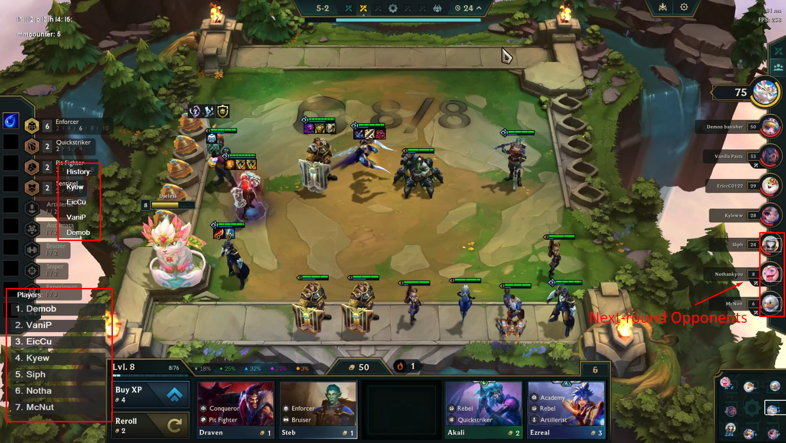
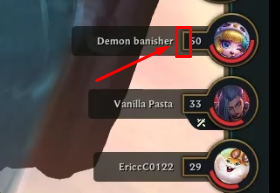

## 📊 TFT Matchup Predictor (2021)

A real-time AHK-based tool for predicting upcoming opponents in *Teamfight Tactics*, using only screen data and a fully custom-built OCR system. Used in high-rank competitive matches and later deprecated when Riot Games implemented the feature natively.

---

### 🔧 Background
**What it does:** Teamfight Tactics pits 8 players in ongoing 1v1 rounds. Each matchup is randomly drawn from a deterministic subset of opponents. This tool identifies that subset, overlaying valid opponents each round. 

**Why it matters:** Accurately predicting matchups manually is theoretically possible, but difficult and impractical during gameplay. 
Having accurate matchup info enables optimal unit positioning and strategies that exploit battle dynamics, offering a major edge in high-level play. 

---

### 🎯 Key Features  
- Custom OCR implementation via AHK’s `ImageSearch` for multi-font name detection
- Dynamic overlay showing next-round opponents in real‐time  
- Automatic calibration using fixed on-screen UI anchors
- Adaptation to player deaths and lobby sorting rules  

---

### 🧠 Implementation Overview
#### 🖼️ Custom OCR System
AHK lacks built-in OCR. This was solved by:
- Manually created a database of individual character images (A–Z, a–z, 1-9) for both fonts used in TFT’s UI.
- Used `ImageSearch` to detect characters within specific screen regions, using UI anchors to determine the search area.
- Reconstructed strings by parsing image matches, which were used to match the current opponent to the player to their listing in the sidebar.

#### 🎯 Matchup Prediction Logic
- Implemented the internal TFT matchmaking rules manually.
- Accounted for edge cases: odd lobby counts, dead players, and rules that prevent facing the same player too many times in a row.
- Tracked previous rounds to exclude recent opponents and used that data to compute eligible future opponents.

#### 💻 Overlay Rendering

Once opponents were identified:
- The tool searched the sidebar using OCR to locate where each viable opponent was listed.
- Overlay indicators were drawn over their icons using AHK GUI elements, updating automatically with new information.

#### 📌 Screen Calibration
- Used indicator UI elements to dynamically define screen regions for 'ImageSearch' scans, minimizing search time and optimizing character recognition speed.

---

### 📚 Technical Deep Dive:

#### Reading the Player Listing Sidebar 

Used to generate the initial list of players, as well as positioning the overlay to indicate possible opponents in the next round.
> 
> Search the right-edge of the screen for the following image:
> 
> 
> 
> This gives us the exact location right of where the top-most player's name is.
> 
> 
> 
> Then, we can begin image-detecting for each letter of the side-bar player name font.
> A small window is constantly shifted left - by large increments when a letter is matched, and smaller when no match was found.

> 

---

### 📈 Results & Impact

- Used personally at Master+ ranks in real matches.
- Significantly improved matchmaking prediction consistency and decision-making under pressure.
- Eventually deprecated after Riot introduced the same feature natively — with *identical output logic*.

---

### 🧹 Caveats

- **Legacy codebase:** This project was built early in my programming journey. While the logic and design are strong, the code quality is quite lacking.
- However, I still wanted to showcase this project, as it demonstrates:
  - Reverse engineering and automation skills
  - UI parsing without APIs
  - Real-world impact in a competitive environment

---

### 📸 Visuals

*(Include at least one GIF showing the overlay updating mid-match, and a screenshot of OCR in action.)*

---

### 🧠 Lessons Learned

- Creative use of limited tools can rival fully integrated solutions.
- Building UI-based automations is a powerful way to reverse-engineer closed systems.
- Even "hacky" implementations can offer deep technical value — especially when built under tool or access constraints.

This was a rapid solo prototype with some copy-pasting and hardcoded logic. The source is included for completeness but is not polished or optimized. For a deeper understanding, please refer to the project writeup and overview.

This project was originally developed five years ago when I was just starting out with programming. While the codebase reflects an early learning phase and isn’t up to my current standards, the project remains a valuable demonstration of my problem-solving skills and creativity. Since then, my coding practices and architectural design skills have significantly improved, as you’ll see in my more recent projects.

within the right edge of the screen, search from top of screen for player tag
- use as anchor for checking where to start reading for a name
- read name
