# 📊 Real-Time Opponent Predictor for Teamfight Tactics (2021)
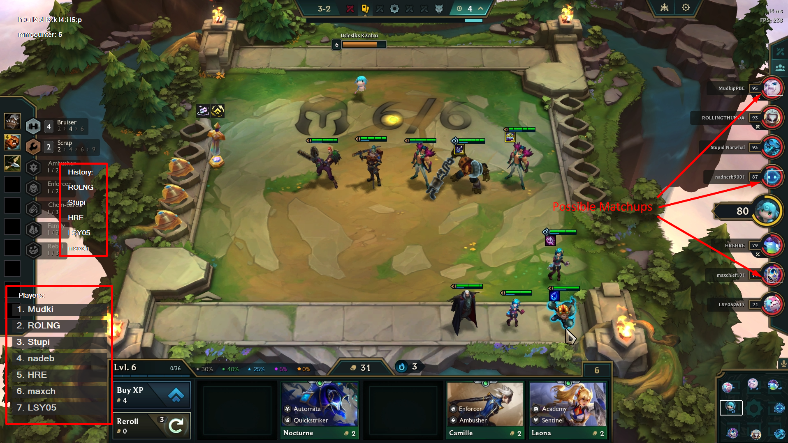
A lightweight tool built in AutoHotKey (AHK) to predict upcoming opponents in Teamfight Tactics by reading on-screen UI elements with a custom Optical Character Recognition (OCR) system.

---

### 🔧 Background
*Teamfight Tactics* pits 8 players in ongoing 1v1 rounds, where each matchup is randomly drawn from a deterministic subset of opponents. This tool identifies that subset and overlays a visual indicator on the corresponding opponents.

**Why it matters:**  
While players can theoretically predict matchups manually, doing so mid-game is time consuming, error-prone, and impractical. Automating this process allows the player to focus on other aspects of gameplay, as well as enables strategically positioning for the opponents they're matching up against.

---
 
### 🎯 Key Features  
- Developed a custom OCR pipeline leveraging AutoHotKey’s `ImageSearch` to recognize multi-font player names in real-time.
- Implemented a dynamic overlay to display next-round opponents in real-time  
- Built an automatic calibration system using fixed on-screen UI anchors  
- Designed logic to adapt to player deaths and lobby sorting rules

&nbsp;
# 🧠 Implementation Overview
🖼️ **Custom OCR System**

AHK lacks built-in OCR. So I made one myself:
- Manually created a database of individual character images (A–Z, a–z, 1-9) for both fonts used in TFT’s UI.
- Uses AHK's `ImageSearch` to detect character images within specific screen regions, making use of UI anchors to minimize the search area. 
- Reconstructs strings by parsing image matches, then uses them to match the current opponent to their listing in the sidebar.
---

🎯 **Matchup Prediction Logic**
- Implements the internal TFT matchmaking rules manually.
- Accounts for edge cases: odd lobby counts, dead players, and rules that prevent facing the same player too many times in a row.
- Tracks previous rounds to exclude recent opponents, uses that data to compute eligible future opponents.
---

💻 **Overlay Rendering**
- Actively scans the sidebar using OCR to locate where each viable opponent is listed.
- Draws indicators over valid opponent icons using AHK GUI elements, updating automatically with new information.
---

📌 **Screen Calibration**
- Uses indicator UI elements to dynamically define screen regions for 'ImageSearch' scans, minimizing search time and optimizing character recognition speed.

&nbsp;
# 📚 Technical Writeup (the interesting part!)

### 1. Reading the Player List

*Generating the initial list of players, and keeping track of their location on the in-game sidebar.*
> 

> 
Click to Expand (seriously, do it)

>
> ## Step 1: Locating Anchor Image  
> Search the right-edge of the screen for the following image:  
>  
>
> This will be known as the "anchor", as it gives us an exact, consistent location relative to a player's name (in this case, the top-most one).  
> 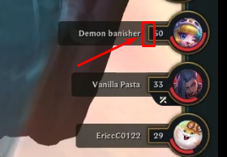
>
> ## Step 2: Letter Matching  
> Using the location where the anchor image was found, a small search area is created where the `ImageSearch` will search within. 
> *This approach significant reduces the time required for search attempts by minimizing the search area.*
>
> Within the search area, run `ImageSearch` on all pre-defined character images of the character set. (`a-z`, `A-Z`, `0-9`)  
> After a character is found (or none are), the search area shifts left — more on success, as the found character occupies the region.
> 
> *Red visual indicates approximate search area.*  
> 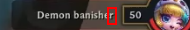 Read: `r`  
>  Read: `re`  
> 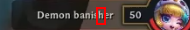 Read: `reh`
>
> Matched letters are stored in order, only keeping the most recent `5` letters.  
> 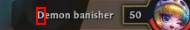 Read: `nomeD`
> 
> ## Step 3: Finalization and Reinitializing  
> When no letter is found repeatedly, the program terminates the loop, and reverses the string.  
> 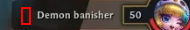 Terminate, Read: `nomeD` --> `Demon`  
> This is now the common name attributed to this player.
>
> We now need to search for the next anchor image, corresponding to the next player in the sidebar.  
> The search area will be the right edge of the screen (as before), but now only starting below where the last anchor was found.  
> 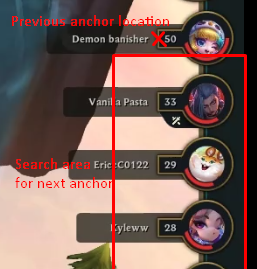
>
> Next: Repeat from Step 2, until all players in the lobby have been accounted for.
>
> ## Final Result
> Certain letters are ignored, as they are difficult to accurately detect and differentiate, for example `I/1/l`. 
>
> Duplicate letters are also discarded, in order to simplify the shifting of the search area.  
> *Otherwise, thin characters such as `t` or `I` may be detected and recorded twice.*
>
> The same rules are applied to the OCR process used to detect the current opponent to keep consistency.  
> 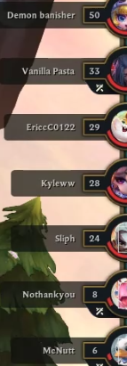 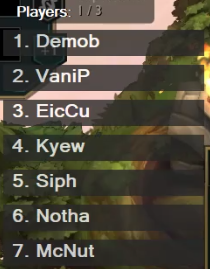  
> `Demon` *becomes* `Demob` *because of the prior occurence of* `n` *in* `Demon banisher`.
> 

### 2. Indicating Possible Matchups
*Determining the possible opponents and displaying a visual indicator on them in real time.*
> 

> 
Click to Expand

>
> ## Step 1: Update Dead Players
> 
> As part of the process of reading names in [Section 1](#1-reading-the-player-list), the program checks whether each player is still alive.
>
> This is determined by checking if their health is not `0`, which is indicated by a failure of `ImageSearch` in matching of the following image right of the anchor:  
> 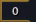
>
> Conversely, the corresponding player is marked as dead and excluded from future matchup predictions if the image is found.
> 
> ## Step 2: Update Match History
>
> Using the same OCR process that reads player names, the tool also detects which opponent the player is currently fighting.
> 
> The anchor image used in this case is the following: 
> *(For more information about the anchor, refer to [Section 1](#1-reading-the-player-list))*  
> 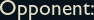
>
> No need for reversal in this case, as the anchor is left of the name — the letters are detected left to right.  
> 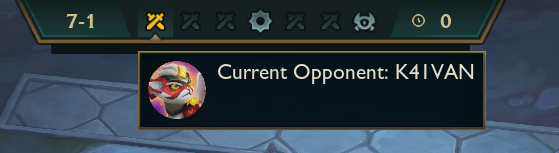  
> *The font for this text is different from the sidebar, and is the main motivation behind implementing OCR. If this were not the case, a well-positioned snapshot of each player name in the sidebar on initialization, followed with image matching such snapshots in this location would suffice in matching the current opponent to their location on the sidebar.*
>
> These names are then recorded in a list of recently faced opponents.  
>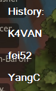 
> 
> ## Step 3: Calculate Possible Matchups
>
> The game enforces a rule: you cannot face any of your last `(4 - # of dead players)` opponents.
> - With all 8 players alive, you cannot face the 4 opponents you have most recently fought.
> - After a player has died, you cannot face the last 3 that you have most recently fought. 
>
> Using the list of remaining players (Step 1), and constantly-updated match history (Step 2), these rules are used to compute which players are valid opponents in the next round.
>
> Visual indicators are overlayed on eligible opponents while reading names from the sidebar — which is done constantly in order to account for player positions in the sidebar changing over the course of a game. 
>
> The result is a reliable visual overlay perpetually indicating possible opponents for the next round.  
> 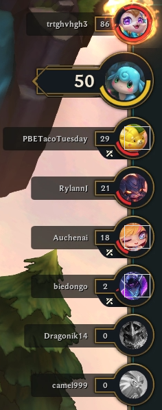
> 

&nbsp;
# 🏆 Results & Impact

- Used personally at Grandmaster+ ranks (top 0.1% of ranked playerbase) in real matches.
- Improved ability to make use of positioning strategies and make gameplay decisions under pressure.
- Eventually deprecated after *Riot Games* introduced the same feature natively — *mirroring this tool’s predictions identically*.

*Real-time updating of visual indicators in response to players changing positions in the UI:*  
  
*Possible Opponents: "MrÉ", "Get Caryed", "MIGGY"*

&nbsp;
# 🧹 Caveats
🖼 **Static Image Detection**  
Uses pre-defined image references for anchors and OCR
- Any visual UI change needs a manual update to restore functionality.

---

🌐 **Limited Character Support**  
Only detects A–Z, a–z, and 0–9.
- Players with identical names (except for unsupported characters) may be indistinguishable.

---

🐣 **Legacy Codebase**  
Built during the earliest stages of my programming career. While the logic is solid, the code lacks polish.  
However, the underlying design demonstrates core competencies:
  - Reverse engineering and automation skills
  - End-user perspective UI parsing without APIs
  - Achieving accuracy equal to native implementation
  - Real-world impact in a competitive environment

&nbsp;
# 🧠 Lessons Learned
⌚ **Balancing Accuracy with Real-Time Constraints**  
Optimizing for both speed and precision revealed the core challenge of real-time perception systems: small delays or inaccuracies can compound rapidly.  
- Tuning OCR tolerances required balancing false positives against missed detections under time pressure.  
- Designing for speed meant simplifying recognition pipelines while ensuring correctness didn’t degrade — a recurring tension in time-critical AI.

---

🔍 **Treating the UI as Ground Truth**  
Lacking any backend or telemetry access, I had to reconstruct system state purely from on-screen visuals.  
- This forced me to treat the UI as the sole observable layer and reverse-engineer internal logic based on visual cues alone.  
- It highlighted the importance of modeling imperfect, user-facing interfaces as data sources — and the assumptions and errors that can follow.

---

🧨 **Designing for Fault Tolerance in State-Driven Systems**  
In systems where each decision depends on prior observations, a single misread can lead to cascading errors.  
- This taught me the importance of designing with uncertainty in mind: introducing fallback strategies, confidence thresholds, and manual override options.  
- Robustness came not from perfect inputs, but from resilient architecture that assumed mistakes would happen — and provided the user methods to adjust accordingly.
  
   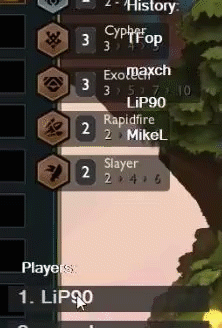  
   **Manual error correction example, opponent history updates automatically.*

