# 📊 TFT Matchup Predictor (2021)

A real-time AutoHotKey (AHK) based tool for predicting upcoming opponents in *Teamfight Tactics*, using only screen data and a custom-built Optical Character Recognition (OCR) system. Used in high-rank competitive matches and later deprecated when Riot Games implemented the feature natively.

---

### 🔧 Background
Teamfight Tactics pits 8 players in ongoing 1v1 rounds. Each matchup is randomly drawn from a deterministic subset of opponents. This tool identifies that subset and overlays a visual indicator on valid upcoming opponents.

**Why it matters:**  
Accurately predicting and tracking these matchups manually is theoretically possible, but difficult and impractical during gameplay. 
Having accurate matchup info enables the player to optimally position units for upcoming fights, and employ strategies that exploit battle dynamics, offering a major edge in high-level play. 

---
 
### 🎯 Key Features  
- Custom OCR implementation via AHK’s `ImageSearch` for multi-font name detection
- Dynamic overlay showing next-round opponents in real‐time  
- Automatic calibration using fixed on-screen UI anchors
- Adaptation to player deaths and lobby sorting rules

&nbsp;
# 🧠 Implementation Overview
🖼️ **Custom OCR System**

AHK lacks built-in OCR. So I made one myself:
- Manually creating a database of individual character images (A–Z, a–z, 1-9) for both fonts used in TFT’s UI.
- Using `ImageSearch` to detect characters within specific screen regions, using UI anchors to determine the search area. 
- Reconstructing strings by parsing image matches, then using them to match the current opponent to the player to their listing in the sidebar.
---

🎯 **Matchup Prediction Logic**
- Implemented the internal TFT matchmaking rules manually.
- Account for edge cases: odd lobby counts, dead players, and rules that prevent facing the same player too many times in a row.
- Track previous rounds to exclude recent opponents and use that data to compute eligible future opponents.
---

💻 **Overlay Rendering**

Once opponents are identified:
- The tool actively scans the sidebar using OCR to locate where each viable opponent is listed.
- Overlay indicators are drawn over their icons using AHK GUI elements, updating automatically with new information.
---

📌 **Screen Calibration**

Uses indicator UI elements to dynamically define screen regions for 'ImageSearch' scans, minimizing search time and optimizing character recognition speed.

&nbsp;
# 📚 Technical Writeup (How it Works)

### 1. Reading the Player List

*Generating the initial list of players, and keeping track of their location on the in-game sidebar.*
> 

> 
Expand

>
> ## Step 1: Locating Anchor Image  
> Search the right-edge of the screen for the following image:  
>  
>
> This gives us the exact location right of the top-most player's name.  
> 
>
> ## Step 2: Letter Matching  
> Using the location where the anchor image was found, a small search area is created where the `ImageSearch` will occur.  
> *This approach enables a highly efficient search of all supported alphanumeric characters.*
> 
> When a letter is matched, or no match is found for any letter, the search area is shifted left (by a larger value on match).
> 
> *Red rectangle indicates approximate search area - only for visual explanation*  
> 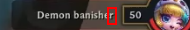 Read: `r`  
>  Read: `re`  
> 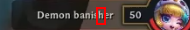 Read: `reh`
>
> Matched letters are stored in order, only keeping the most recent `5` letters.  
>  Read: `nomeD`
> 
> ## Step 3: Finalization and Reinitializing  
> When no letter is found repeatedly, the program terminates the loop, and reverses the string.  
> 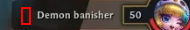 Terminate, Read: `nomeD` --> `Demon`
>
> We can now search for the next anchor image, which corresponds to the next player in the sidebar.
>
> The search area for this anchor image is now restricted to the right edge of the screen, below where the last anchor was found.  
> 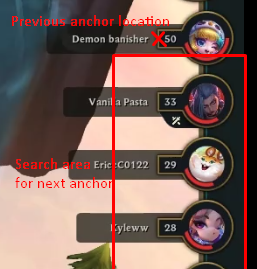
>
> Next: Repeat from Step 2, until all players in the lobby have been accounted for.
>
> ## Final Result
> Certain letters are ignored, as they are difficult to accurately detect and differentiate: `n/h`, `I/1/l`, etc.  
> Consecutive duplicate letters are also discarded, in order to simplify the shifting of the search area.
>
> These caveats don't affect accuracy, as the same rules are applied to the OCR used to detect the current opponent, resulting in consistent output and successful correspondence.  
> 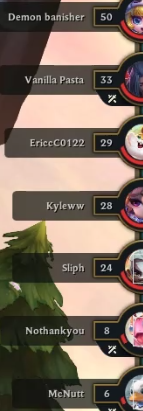 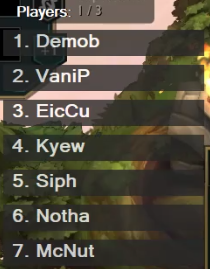
> 

### 2. Indicating Possible Matchups
*Determining the possible opponents and displaying a visual indicator on them in real time.*
> 

> 
Expand

>
> ## Step 1: Update Dead Players
> 
> As part of the process of reading names in [Section 1](#1-reading-the-player-list), the program checks whether each player is still alive.
>
> This is determined by checking if their health is `0`, which is visually indicated by the following image found just to the right of the anchor:  
> 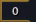
>
> Using `ImageSearch`, the corresponding player is marked as dead and excluded from future matchup predictions if the image is found.
> 
> ## Step 2: Update Match History
>
> Using the same OCR process that reads player names, the tool also detects which opponent the player is currently fighting.
> 
> The anchor used in this case is as follows: 
> *(For more information about the anchor, refer to [Section 1](#1-reading-the-player-list))*  
> 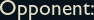
>
> No need for reversal in this case, as the anchor is left of the name — the letters are detected left to right.  
> 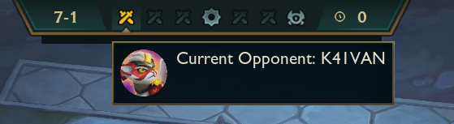  
> *The font for this text is different from the sidebar, and is the main motivation behind implementing OCR - The player indicated by this UI needs to be matched to the corresponding player in the sidebar.*
>
> These names are then recorded in a list of recently faced opponents.  
>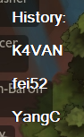 
> 
> ## Step 3: Calculate Possible Matchups
>
> The game enforces a rule: you cannot face any of your last `(4 - # of dead players)` opponents.
> - With all 8 players alive, you cannot face the 4 opponents you have most recently fought.
> - After a player has died, you cannot face the last 3 that you have most recently fought. 
>
> Using the list of remaining players (Step 1), and constantly-updated match history (Step 2), these rules are used to compute which players are valid opponents in the next round.
>
> Visual indicators are overlayed on eligible opponents while reading names from the sidebar — which is done constantly in order to account for player positions in the sidebar changing over the course of a game. 
>
> The result is a reliable visual overlay perpetually indicating possible opponents for the next round.  
> 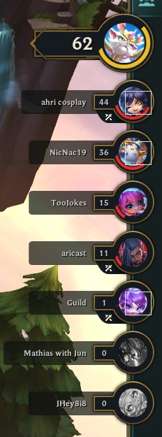
> 

&nbsp;
# 🏆 Results & Impact

- Used personally at Grandmaster+ ranks (top 0.1% of ranked playerbase) in real matches.
- Significantly improved ability to make use of positioning strategies and make gameplay decisions under pressure.
- Eventually deprecated after Riot Games introduced the same feature natively — *mirroring this tool’s prediction logic identically*.

*Real-time updating of visual indicators in response to players changing positions in the UI:*  
  
*Possible Opponents: "MrÉ", "Get Caryed", "MIGGY"*

&nbsp;
# 🧹 Caveats
🖼 **Static Image Detection**  
Uses fixed image references for anchors and OCR — any visual UI change can break functionality.

---

🌐 **Limited Character Support**  
Only detects A–Z, a–z, and 0–9. Players with identical names (except for unsupported characters) may be indistinguishable.

---

🐣 **Legacy Codebase**  
Built during the earliest stages of my programming career. While the logic is solid, the code lacks polish.  
However, the underlying design demonstrates core competencies:
  - Reverse engineering and automation skills
  - End-user perspective UI parsing without APIs
  - Achieving accuracy equal to native implementation
  - Real-world impact in a competitive environment

&nbsp;
# 🧠 Lessons Learned
⌚ **Designing for Accuracy and Speed**  
Real-time performance required optimizing OCR tolerances and implementing techniques to improve search efficiency to match fast-paced gameplay.

---

🔍 **UI as a Data Source**  
With no telemetry or API access, the entire system was built from observed visuals — teaching me to extract state from in-game UI and simulate internal game logic.

---

🧨 **Handling Cascading Errors**  
The system is state-dependent: one OCR mismatch can snowball and misalign future predictions.  
- This taught me to design with fault tolerance in mind — adding safe defaults, user intervention options, and understanding how to gracefully handle imperfect data.

   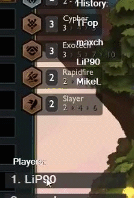

